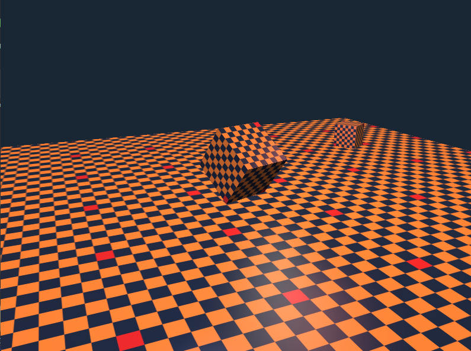

# Renderer

A small real-time 3D renderer written from scratch in modern C++ on top of **OpenGL 3.3**. It started as a way to learn the graphics pipeline hands-on, and grew into a little engine with shadow-casting lights, a multi-light Blinn–Phong shading model, an offscreen post-processing stage, and a minimal entity/transform scene system.




## What it does

The renderer draws an animated scene; a spinning textured cube, a smaller cube orbiting and bobbing around it, and a tiled floor; using a three-pass pipeline:

1. **Shadow pass** - the scene's depth is rendered from the sun's point of view into a 2048×2048 depth texture (the *shadow map*).
2. **Scene pass** - the scene is shaded into an offscreen texture. Each fragment looks itself up in the shadow map to decide whether it's lit by the sun, and is also lit by three coloured point lights.
3. **Post pass** - a single full-screen quad samples the offscreen texture through a post-processing shader, applying an optional screen-space effect before it hits the window.

### Features

- **Directional sun with real-time shadows** via shadow mapping, softened with 3×3 **PCF** (percentage-closer filtering) and slope-scaled depth bias to fight shadow acne.
- **Blinn–Phong lighting** with one shadow-casting directional light plus three coloured point lights with distance attenuation.
- **Gamma-correct shading** (sRGB → linear → sRGB) so the lighting math runs in linear space.
- **Offscreen rendering** to a framebuffer object, enabling screen-space **post effects**: grayscale, invert, and vignette (toggle with the number keys).
- **`.obj` model loading** (via `tiny_obj_loader`) and **PNG texture loading** (via `stb_image`).
- **Free-fly camera** with WASD movement and mouse look.
- A tiny **scene graph**: the world is a `std::vector<Entity>`, where each `Entity` carries a mesh, a `Transform`, and an optional per-frame `update` lambda for animation.

## Controls

| Input        | Action                          |
|--------------|---------------------------------|
| `W A S D`    | Move the camera                 |
| Mouse        | Look around                     |
| `0`          | No post effect                  |
| `1`          | Grayscale                       |
| `2`          | Invert                          |
| `3`          | Vignette                        |
| `Esc`        | Quit                            |

## Building

The project uses CMake. GLFW and GLM are fetched automatically via `FetchContent`; GLAD and the single-header libraries (`stb_image`, `tiny_obj_loader`) are vendored under `external/`.

**Requirements**
- A C++17 compiler
- CMake 3.25+
- A GPU/driver supporting OpenGL 3.3 core

```bash
cmake -S . -B build
cmake --build build
./build/Renderer        # or build\Renderer.exe on Windows
```

The asset folder is baked in at compile time (`ASSET_DIR`), so the executable finds `assets/` no matter where it's run from.

## Project layout

| File / class      | Responsibility                                                        |
|-------------------|-----------------------------------------------------------------------|
| `main.cpp`        | Window/context setup, all GLSL shaders, and the three-pass render loop |
| `Camera`          | Free-fly camera - position, look direction, and the view matrix        |
| `Mesh`            | Owns the GPU vertex buffers for one model; `loadOBJ` parses `.obj`     |
| `Texture`         | Loads an image and owns the GPU texture handle                         |
| `Transform`       | Position / rotation / scale → a single model matrix                    |
| `Entity`          | One scene object: a (shared) mesh, a transform, and an update hook     |
| `Framebuffer`     | An offscreen colour+depth render target for the post-processing stage  |

The GPU-resource classes (`Mesh`, `Texture`, `Framebuffer`) follow the same pattern: they own raw OpenGL handles, free them in their destructor, and forbid copying to avoid double-frees.

## What I learned

This was a from-scratch learning project, and most of the interesting parts were the things that aren't obvious until you actually wire up the pipeline yourself:

- **The graphics pipeline end to end** - how vertex data flows from a buffer, through the vertex shader's model/view/projection transforms, into clip space, and out as shaded fragments.
- **Shadow mapping** - that a shadow is really a depth comparison: render the scene's depth from the light, then in the main pass ask "is this pixel further from the light than whatever the map recorded?" Getting this right meant learning about the perspective divide, the NDC → texture-space remap, and the two classic artifacts - **shadow acne** (fixed with a slope-scaled bias) and hard, jagged edges (softened with PCF).
- **Why lighting wants linear space** - textures are stored in sRGB, but adding light contributions only looks correct in linear space, so you convert in and out (gamma correction).
- **Blinn–Phong** - separating ambient / diffuse / specular, and how the halfway vector and distance attenuation shape a light.
- **Render-to-texture and framebuffer objects** - that the window is just the "default framebuffer", and you can render into your own texture instead, which is the foundation for every screen-space effect.
- **Owning GPU resources safely in C++** - RAII for OpenGL handles, and why these classes must delete their copy constructors.
- **Decoupling the scene from the render loop** - moving from hard-coded objects to a `vector<Entity>` with per-entity animation lambdas, so adding something to the world is just a `push_back`.

## Where it could go next

The offscreen post-processing stage was built deliberately as groundwork - it's the natural place to add blur, bloom, FXAA, or an upscaler. Other directions: a proper material system, multiple shadow-casting lights, normal mapping, and frustum culling.

## Third-party libraries

- [GLFW](https://www.glfw.org/) - windowing and input
- [GLAD](https://glad.dav1d.de/) - OpenGL function loading
- [GLM](https://github.com/g-truc/glm) - vector/matrix math
- [stb_image](https://github.com/nothings/stb) - image loading
- [tiny_obj_loader](https://github.com/tinyobjloader/tinyobjloader) - `.obj` parsing
